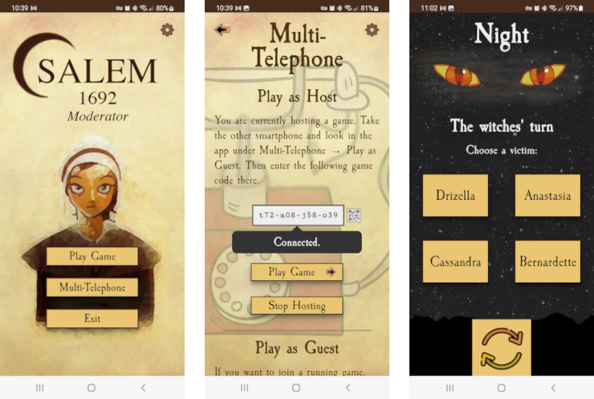

# Moderator PWA for the card game Salem 1692

A web app for fulfilling the moderator role in the Salem 1692 card game



## Rationale for this App

The game [Salem 1692](https://www.boardgamegeek.com/boardgame/175549/salem-1692),
published by [Façade Games](https://facadegames.com/products/salem-1692)
is a game in which some of the players are witches, plotting to murder the
innocent villagers.

The game has day and night phases. During the night phase, all players
need to close their eyes so that the witches can secretly choose a
victim.  Ideally, the night phase makes use of a moderator. However,
this moderator cannot also be player.

This app takes on the role of moderator, so that all human participants
can be players. It also allows to connect to the game with multiple
smartphones, so that players don't have to reach across the table to
take a vote.


## PWA Hosting

- [Project on GitHub](https://github.com/ruittenb/salem-1692)
- [See this web app in action](https://ruittenb.github.io/salem-1692/)
- [Firebase Console](https://console.firebase.google.com/u/0/project/salem-1692-moderator-new/overview)

## Technologies Used

- [ReScript](https://rescript-lang.org/docs/manual/latest/overview)
  - [ReScript Forum](https://www.reddit.com/r/rescript/)
- [Spice](https://github.com/green-labs/ppx_spice) (replaces [~~Decco~~](https://github.com/reasonml-labs/decco))
- [React](https://reactjs.org/docs/getting-started.html)
  - [ReScript-React](https://rescript-lang.org/docs/react/latest/introduction)
- [Firebase Realtime Database](https://firebase.google.com/docs/database)
  - [Getting Started (documentation)](https://firebase.google.com/docs/database/web/start)
  - [Getting Started (video)](https://www.youtube.com/watch?v=rQvOAnNvcNQ)
- [Git Subtree](https://www.atlassian.com/git/tutorials/git-subtree)

## Directory Structure

- [src/](src/) ReScript source files
- [dist/](dist/) Compiled files and web root
- lib/ Workdirectory for compiler
- [doc/](doc/) Dialogue scripts
- [database/](database/) Firebase rules and example data

## Prerequisites

- GNU make

## Building

```
make all
```

Output files will be put in `dist/`

## Serving

For running locally, a webserver may be started with:

```
make serve
```

## Features

It is possible to add the desired language setting in the query string
using any of the language codes from [LanguageCodec](src/modules/LanguageCodec.res),
for example:

- http://localhost:3001/?lang=pt_BR

## Supported Browsers (minimal versions)

- Chrome 99
- Chrome for Android 99
- Firefox 98
- Firefox for Android 96
- Safari 15.4
- Safari on iOS 15.4
- Edge 99
- Android Browser 99
- Samsung Internet 16
- Opera 83

## Debugging

Debugging output (in the browser console) can be obtained by changing the User-Agent string
to contain the text "Salem/1692".

How to do this on: [Chrome](https://www.alphr.com/change-user-agent-string-google-chrome/),
[Firefox/Edge](https://geekflare.com/change-user-agent-in-browser/),
[Safari](https://www.technipages.com/how-to-change-user-agent-in-safari).
